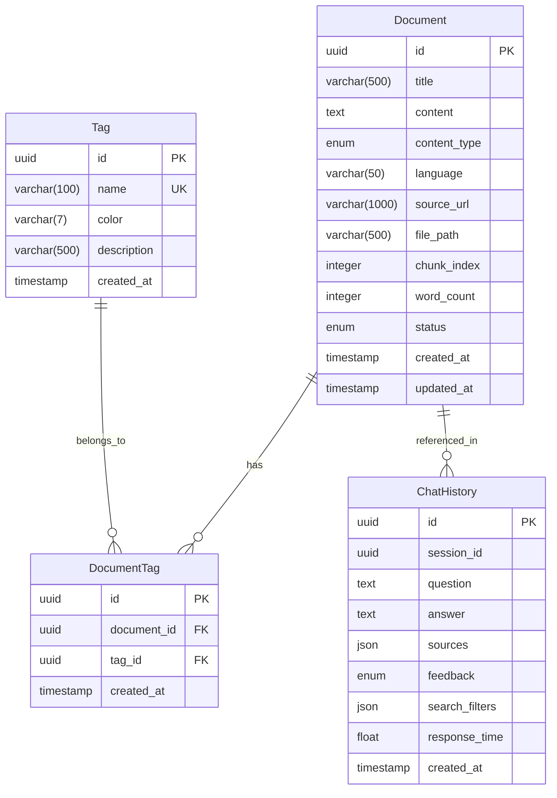

# StudyMind ERD (Entity-Relationship Diagram)

## 📋 문서 정보

- **프로젝트명**: StudyMind (개인 학습 RAG 챗봇)
- **버전**: v1.0 (MVP - Phase 1)
- **작성일**: 2025-09-29
- **대상 기간**: 2025-09-29 ~ 2025-10-03 (P0 엔티티)

---

## 🎯 ERD 개요

### 설계 원칙

1. **MVP 우선**: 10/3까지 RAG 챗봇 동작에 필수적인 엔티티만 포함
2. **정규화**: 3NF 수준 유지 (데이터 중복 최소화)
3. **확장성**: Phase 2, 3 엔티티 추가를 고려한 구조
4. **성능**: 주요 검색 패턴에 맞는 인덱스 설계

### 데이터 저장소 분리

- **FAISS**: Embedding 벡터 (벡터 검색 전용)
- **SQLite**: 메타데이터, 관계, 로그 (상세 정보 및 통계)

---

## 📊 엔티티 목록

### Phase 1 (P0 - MVP 필수)

| 엔티티          | 역할                       | 우선순위 | 구현 시점 |
| --------------- | -------------------------- | -------- | --------- |
| **Document**    | 학습 문서 저장 및 관리     | P0       | 9/30      |
| **Tag**         | 문서 분류용 태그           | P0       | 9/30      |
| **DocumentTag** | Document ↔ Tag 다대다 관계 | P0       | 9/30      |
| **ChatHistory** | 질문-답변 기록             | P0       | 10/2      |

---

## 🗂️ 엔티티 상세 정의

### 1. Document (학습 문서)

**역할**: 노션에서 가져온 학습 자료, RAG 검색의 기본 단위

#### 필드 정의

| 필드명         | 타입          | 제약         | 기본값             | 설명                                 | 예시                                   |
| -------------- | ------------- | ------------ | ------------------ | ------------------------------------ | -------------------------------------- |
| `id`           | UUID          | PK, NOT NULL | uuid_generate_v4() | 문서 고유 ID                         | `550e8400-e29b-41d4-a716-446655440000` |
| `title`        | VARCHAR(500)  | NOT NULL     | -                  | 문서 제목                            | `"FastAPI 비동기 처리 가이드"`         |
| `content`      | TEXT          | NOT NULL     | -                  | 문서 전체 내용                       | `"FastAPI에서 비동기는..."`            |
| `content_type` | ENUM          | NOT NULL     | `'text'`           | 콘텐츠 유형                          | `'text'`, `'code'`, `'mixed'`          |
| `language`     | VARCHAR(50)   | NULL         | NULL               | 코드 언어 (content_type='code'일 때) | `'python'`, `'javascript'`             |
| `source_url`   | VARCHAR(1000) | NULL         | NULL               | 노션 원본 URL                        | `'https://notion.so/...'`              |
| `file_path`    | VARCHAR(500)  | NOT NULL     | -                  | Export 파일 경로                     | `'data/notion_export/fastapi.md'`      |
| `chunk_index`  | INTEGER       | NULL         | NULL               | Chunk 순서 (분할된 경우)             | `0`, `1`, `2`                          |
| `word_count`   | INTEGER       | NOT NULL     | 0                  | 단어 수                              | `1250`                                 |
| `status`       | ENUM          | NOT NULL     | `'draft'`          | 문서 상태                            | `'active'`, `'archived'`, `'draft'`    |
| `created_at`   | TIMESTAMP     | NOT NULL     | CURRENT_TIMESTAMP  | 생성 일시                            | `2024-09-29 10:30:00`                  |
| `updated_at`   | TIMESTAMP     | NOT NULL     | CURRENT_TIMESTAMP  | 수정 일시                            | `2024-09-29 15:45:00`                  |

#### ENUM 타입 정의

```sql
-- content_type
ENUM('text', 'code', 'mixed')
-- 'text': 순수 텍스트 (코드 블록 없음)
-- 'code': 순수 코드 파일 (설명 없음, 예: .py 파일)
-- 'mixed': 텍스트 + 코드 혼합 (대부분의 노션 문서)

-- status
ENUM('active', 'archived', 'draft')
```

#### 인덱스

```sql
CREATE INDEX idx_document_status ON Document(status);
CREATE INDEX idx_document_created_at ON Document(created_at DESC);
CREATE INDEX idx_document_word_count ON Document(word_count);
CREATE INDEX idx_document_file_path ON Document(file_path);
```

#### 비즈니스 규칙

- `chunk_index`가 NULL이면 원본 문서, 0 이상이면 분할된 chunk
- `content_type`:
  - `'text'`: 순수 텍스트만 (코드 블록 없음)
  - `'code'`: 순수 코드 파일 (`.py`, `.js` 등)
  - `'mixed'`: 텍스트 + 코드 혼합 (대부분의 노션 마크다운 문서)
- `content_type='code'`이면 `language` 필드 권장 (nullable이지만 채우는 것이 좋음)
- `content_type='mixed'`이면 `language`는 NULL (여러 언어가 섞일 수 있음)
- `status='draft'`인 문서는 검색/퀴즈에서 제외
- `word_count < 50`인 문서는 검색 결과 필터링 대상

---

### 2. Tag (태그)

**역할**: 문서 분류 및 필터링을 위한 태그

#### 필드 정의

| 필드명        | 타입         | 제약             | 기본값             | 설명          | 예시                                   |
| ------------- | ------------ | ---------------- | ------------------ | ------------- | -------------------------------------- |
| `id`          | UUID         | PK, NOT NULL     | uuid_generate_v4() | 태그 고유 ID  | `650e8400-e29b-41d4-a716-446655440000` |
| `name`        | VARCHAR(100) | UNIQUE, NOT NULL | -                  | 태그 이름     | `"FastAPI"`, `"Redis"`                 |
| `color`       | VARCHAR(7)   | NULL             | NULL               | HEX 색상 코드 | `"#FF5733"`                            |
| `description` | VARCHAR(500) | NULL             | NULL               | 태그 설명     | `"FastAPI 관련 학습 자료"`             |
| `created_at`  | TIMESTAMP    | NOT NULL         | CURRENT_TIMESTAMP  | 생성 일시     | `2024-09-29 10:00:00`                  |

#### 인덱스

```sql
CREATE UNIQUE INDEX idx_tag_name ON Tag(name);
CREATE INDEX idx_tag_created_at ON Tag(created_at DESC);
```

#### 비즈니스 규칙

- `name`은 대소문자 구분하여 유일해야 함 (예: "Redis" ≠ "redis")
- 태그 삭제 시 연결된 `DocumentTag` 레코드도 함께 삭제 (CASCADE)

---

### 3. DocumentTag (연결 테이블)

**역할**: Document와 Tag의 다대다 관계 관리

#### 필드 정의

| 필드명        | 타입      | 제약         | 기본값             | 설명           | 예시                                   |
| ------------- | --------- | ------------ | ------------------ | -------------- | -------------------------------------- |
| `id`          | UUID      | PK, NOT NULL | uuid_generate_v4() | 연결 레코드 ID | `750e8400-e29b-41d4-a716-446655440000` |
| `document_id` | UUID      | FK, NOT NULL | -                  | 문서 ID        | `550e8400-...`                         |
| `tag_id`      | UUID      | FK, NOT NULL | -                  | 태그 ID        | `650e8400-...`                         |
| `created_at`  | TIMESTAMP | NOT NULL     | CURRENT_TIMESTAMP  | 연결 생성 일시 | `2024-09-29 10:30:00`                  |

#### 제약 조건

```sql
FOREIGN KEY (document_id) REFERENCES Document(id) ON DELETE CASCADE
FOREIGN KEY (tag_id) REFERENCES Tag(id) ON DELETE CASCADE
UNIQUE (document_id, tag_id)
```

#### 인덱스

```sql
CREATE INDEX idx_documenttag_document ON DocumentTag(document_id);
CREATE INDEX idx_documenttag_tag ON DocumentTag(tag_id);
CREATE UNIQUE INDEX idx_documenttag_unique ON DocumentTag(document_id, tag_id);
```

#### 비즈니스 규칙

- 동일한 (document_id, tag_id) 조합은 중복 불가
- Document 삭제 시 연결 레코드 자동 삭제
- Tag 삭제 시 연결 레코드 자동 삭제

---

### 4. ChatHistory (채팅 기록)

**역할**: 사용자 질문과 AI 답변 기록 저장

#### 필드 정의

| 필드명           | 타입      | 제약         | 기본값             | 설명                | 예시                                        |
| ---------------- | --------- | ------------ | ------------------ | ------------------- | ------------------------------------------- |
| `id`             | UUID      | PK, NOT NULL | uuid_generate_v4() | 채팅 ID             | `850e8400-e29b-41d4-a716-446655440000`      |
| `session_id`     | UUID      | NOT NULL     | -                  | 세션 ID (대화 그룹) | `950e8400-...`                              |
| `question`       | TEXT      | NOT NULL     | -                  | 사용자 질문         | `"FastAPI 의존성 주입이 뭐야?"`             |
| `answer`         | TEXT      | NOT NULL     | -                  | AI 답변             | `"의존성 주입은..."`                        |
| `sources`        | JSON      | NOT NULL     | `'[]'`             | 참고 문서 ID 목록   | `["550e8400-...", "660e8400-..."]`          |
| `feedback`       | ENUM      | NULL         | NULL               | 사용자 피드백       | `'positive'`, `'negative'`, NULL            |
| `search_filters` | JSON      | NULL         | NULL               | 검색 시 사용한 필터 | `{"tags": ["FastAPI"], "status": "active"}` |
| `response_time`  | FLOAT     | NULL         | NULL               | 응답 시간 (초)      | `2.34`                                      |
| `created_at`     | TIMESTAMP | NOT NULL     | CURRENT_TIMESTAMP  | 질문 일시           | `2024-09-29 14:20:00`                       |

#### ENUM 타입 정의

```sql
-- feedback
ENUM('positive', 'negative')
```

#### 인덱스

```sql
CREATE INDEX idx_chathistory_session ON ChatHistory(session_id);
CREATE INDEX idx_chathistory_created_at ON ChatHistory(created_at DESC);
CREATE INDEX idx_chathistory_feedback ON ChatHistory(feedback);
```

#### JSON 필드 구조

```json
// sources 예시
["550e8400-e29b-41d4-a716-446655440000", "660e8400-e29b-41d4-a716-446655440001"]

// search_filters 예시
{
  "tags": ["FastAPI", "Python"],
  "status": "active",
  "min_word_count": 100
}
```

#### 비즈니스 규칙

- `sources` 배열의 각 ID는 `Document.id` 참조 (강제 FK 아님, 유연성 위해)
- `session_id`는 Streamlit `session_state`나 브라우저 쿠키로 관리
- `feedback`은 사용자가 👍/👎 누르면 업데이트
- `response_time`은 검색 성능 모니터링용

---

## 🔗 관계(Relationship) 정의

### 1. Document ↔ Tag (Many-to-Many)

```
Document (1) ----< DocumentTag >---- (N) Tag
```

- 하나의 문서는 여러 태그를 가질 수 있음
- 하나의 태그는 여러 문서에 할당될 수 있음
- **연결 테이블**: `DocumentTag`

**쿼리 예시**:

```sql
-- "FastAPI" 태그가 달린 모든 문서 조회
SELECT d.*
FROM Document d
JOIN DocumentTag dt ON d.id = dt.document_id
JOIN Tag t ON dt.tag_id = t.id
WHERE t.name = 'FastAPI' AND d.status = 'active';
```

---

### 2. Document ← ChatHistory (One-to-Many, 논리적)

```
Document (1) ----< ChatHistory.sources (JSON 배열)
```

- 하나의 문서는 여러 채팅에서 참고될 수 있음
- 하나의 채팅은 여러 문서를 참고할 수 있음
- **물리적 FK 없음**: JSON 배열로 유연하게 관리

**쿼리 예시**:

```sql
-- 특정 문서가 참고된 모든 채팅 조회 (PostgreSQL JSON 함수)
SELECT ch.*
FROM ChatHistory ch
WHERE ch.sources::jsonb @> '["550e8400-e29b-41d4-a716-446655440000"]'::jsonb;

-- SQLite의 경우 (JSON 함수 지원)
SELECT ch.*
FROM ChatHistory ch, json_each(ch.sources) AS source
WHERE source.value = '550e8400-e29b-41d4-a716-446655440000';
```

---

### 3. ChatHistory 세션 그룹 (Self-referencing)

```
ChatHistory (session_id) ----< ChatHistory (session_id)
```

- 동일한 `session_id`를 가진 레코드들이 하나의 대화 세션을 구성
- 시간 순서대로 정렬하면 대화 흐름 파악 가능

**쿼리 예시**:

```sql
-- 특정 세션의 전체 대화 기록 조회
SELECT question, answer, created_at
FROM ChatHistory
WHERE session_id = '950e8400-e29b-41d4-a716-446655440000'
ORDER BY created_at ASC;
```

---

## 📐 ERD 다이어그램

### Mermaid 다이어그램



### 텍스트 다이어그램

```
┌─────────────────────┐         ┌──────────────────┐         ┌─────────────────┐
│     Document        │         │   DocumentTag    │         │      Tag        │
├─────────────────────┤         ├──────────────────┤         ├─────────────────┤
│ id (PK)             │──┐      │ id (PK)          │      ┌──│ id (PK)         │
│ title               │  │      │ document_id (FK) │      │  │ name (UK)       │
│ content             │  └─────→│ tag_id (FK)      │←─────┘  │ color           │
│ content_type        │         │ created_at       │         │ description     │
│ language            │         └──────────────────┘         │ created_at      │
│ source_url          │                                      └─────────────────┘
│ file_path           │
│ chunk_index         │         ┌──────────────────────────┐
│ word_count          │         │     ChatHistory          │
│ status              │         ├──────────────────────────┤
│ created_at          │         │ id (PK)                  │
│ updated_at          │         │ session_id               │
└─────────────────────┘         │ question                 │
                                │ answer                   │
        ┌───────────────────────│ sources (JSON)           │
        │ (논리적 참조)          │ feedback                 │
        └──────────────────────→│ search_filters (JSON)    │
                                │ response_time            │
                                │ created_at               │
                                └──────────────────────────┘
```

---

## 🎯 인덱스 전략

### 검색 성능 최적화

#### 1. Document 테이블

```sql
-- 상태별 필터링 (가장 빈번)
CREATE INDEX idx_document_status ON Document(status);

-- 최신 문서 우선 정렬
CREATE INDEX idx_document_created_at ON Document(created_at DESC);

-- 문서 길이 기반 필터링
CREATE INDEX idx_document_word_count ON Document(word_count);

-- 파일 경로 기반 조회 (중복 방지)
CREATE INDEX idx_document_file_path ON Document(file_path);

-- 복합 인덱스 (상태 + 생성일)
CREATE INDEX idx_document_status_created ON Document(status, created_at DESC);
```

#### 2. Tag 테이블

```sql
-- 태그명 유일성 + 빠른 검색
CREATE UNIQUE INDEX idx_tag_name ON Tag(name);

-- 태그 생성 순서
CREATE INDEX idx_tag_created_at ON Tag(created_at DESC);
```

#### 3. DocumentTag 테이블

```sql
-- Document → Tags 조회
CREATE INDEX idx_documenttag_document ON DocumentTag(document_id);

-- Tag → Documents 조회
CREATE INDEX idx_documenttag_tag ON DocumentTag(tag_id);

-- 중복 방지
CREATE UNIQUE INDEX idx_documenttag_unique ON DocumentTag(document_id, tag_id);
```

#### 4. ChatHistory 테이블

```sql
-- 세션별 대화 조회
CREATE INDEX idx_chathistory_session ON ChatHistory(session_id);

-- 시간 순 정렬
CREATE INDEX idx_chathistory_created_at ON ChatHistory(created_at DESC);

-- 피드백 분석
CREATE INDEX idx_chathistory_feedback ON ChatHistory(feedback);

-- 복합 인덱스 (세션 + 시간)
CREATE INDEX idx_chathistory_session_created ON ChatHistory(session_id, created_at ASC);
```

---

## 🔒 제약 조건 요약

### PRIMARY KEY

- 모든 테이블: `id (UUID)`

### FOREIGN KEY

- `DocumentTag.document_id` → `Document.id` (ON DELETE CASCADE)
- `DocumentTag.tag_id` → `Tag.id` (ON DELETE CASCADE)

### UNIQUE

- `Tag.name` (태그명 중복 불가)
- `DocumentTag(document_id, tag_id)` (동일 조합 중복 불가)

### NOT NULL

- 모든 테이블의 `id`, `created_at`
- Document: `title`, `content`, `content_type`, `file_path`, `word_count`, `status`
- Tag: `name`
- DocumentTag: `document_id`, `tag_id`
- ChatHistory: `session_id`, `question`, `answer`, `sources`

### CHECK 제약

```sql
-- Document
CHECK (word_count >= 0)
CHECK (chunk_index IS NULL OR chunk_index >= 0)
CHECK (content_type IN ('text', 'code'))
CHECK (status IN ('active', 'archived', 'draft'))

-- ChatHistory
CHECK (response_time IS NULL OR response_time >= 0)
CHECK (feedback IS NULL OR feedback IN ('positive', 'negative'))
```

---

## 📝 예상 쿼리 패턴

### 1. 태그별 활성 문서 검색

```sql
SELECT d.id, d.title, d.word_count
FROM Document d
JOIN DocumentTag dt ON d.id = dt.document_id
JOIN Tag t ON dt.tag_id = t.id
WHERE t.name = 'FastAPI'
  AND d.status = 'active'
ORDER BY d.created_at DESC;
```

### 2. 최근 7일간 질문 통계

```sql
SELECT
    DATE(created_at) as date,
    COUNT(*) as question_count
FROM ChatHistory
WHERE created_at >= DATE('now', '-7 days')
GROUP BY DATE(created_at)
ORDER BY date DESC;
```

### 3. 가장 많이 참고된 문서 Top 5

```sql
-- PostgreSQL/SQLite with JSON support
SELECT
    d.id,
    d.title,
    COUNT(ch.id) as reference_count
FROM Document d
JOIN ChatHistory ch ON d.id IN (SELECT value FROM json_each(ch.sources))
WHERE ch.created_at >= DATE('now', '-30 days')
GROUP BY d.id, d.title
ORDER BY reference_count DESC
LIMIT 5;
```

### 4. 긍정 피드백이 많은 답변 패턴 분석

```sql
SELECT
    t.name as tag_name,
    COUNT(ch.id) as positive_count
FROM ChatHistory ch
JOIN Document d ON d.id IN (SELECT value FROM json_each(ch.sources))
JOIN DocumentTag dt ON d.id = dt.document_id
JOIN Tag t ON dt.tag_id = t.id
WHERE ch.feedback = 'positive'
GROUP BY t.name
ORDER BY positive_count DESC;
```

---

## 🔄 Phase 2, 3 확장 계획

### Phase 2 추가 엔티티 (10/7까지)

- **CodeBlock**: 코드 스니펫 별도 관리
- **Quiz**: 퀴즈 문제
- **QuizAttempt**: 퀴즈 풀이 기록
- **LearningLog**: 학습 활동 통합 로그

### Phase 3 추가 엔티티 (선택)

- **Reminder**: Slack 리마인더
- **NotionPage**: 노션 메타데이터 동기화
- **SearchHistory**: 검색 패턴 분석

### 마이그레이션 전략

- Alembic을 사용한 버전 관리
- 기존 데이터 보존하며 스키마 변경
- Backward compatibility 유지

---

## 📊 데이터 볼륨 예상 (1년 기준)

| 테이블      | 예상 레코드 수    | 평균 레코드 크기 | 총 용량    |
| ----------- | ----------------- | ---------------- | ---------- |
| Document    | 500               | 5 KB             | 2.5 MB     |
| Tag         | 50                | 0.2 KB           | 10 KB      |
| DocumentTag | 1,500             | 0.1 KB           | 150 KB     |
| ChatHistory | 7,300 (하루 20개) | 2 KB             | 14.6 MB    |
| **합계**    | -                 | -                | **~17 MB** |

→ SQLite로 충분히 관리 가능한 규모

---

## ✅ 체크리스트

### ERD 설계 완료 항목

- [x] P0 엔티티 4개 정의
- [x] 모든 필드 타입 및 제약 조건 명시
- [x] 관계(Relationship) 정의
- [x] 인덱스 전략 수립
- [x] 예상 쿼리 패턴 문서화
- [x] Phase 2, 3 확장 계획 수립

### 다음 단계

- [ ] SQLAlchemy ORM 모델 작성 (`models.py`)
- [ ] Alembic 마이그레이션 초기화
- [ ] 초기 데이터 시드 스크립트 작성
- [ ] CRUD 함수 인터페이스 정의

---

## 📚 참고 자료

- [SQLAlchemy 공식 문서](https://docs.sqlalchemy.org/)
- [Alembic 마이그레이션 가이드](https://alembic.sqlalchemy.org/)
- [PostgreSQL JSON 함수](https://www.postgresql.org/docs/current/functions-json.html)
- [SQLite JSON 확장](https://www.sqlite.org/json1.html)

---

**작성자**: 박병찬  
**최종 업데이트**: 2025-09-29
